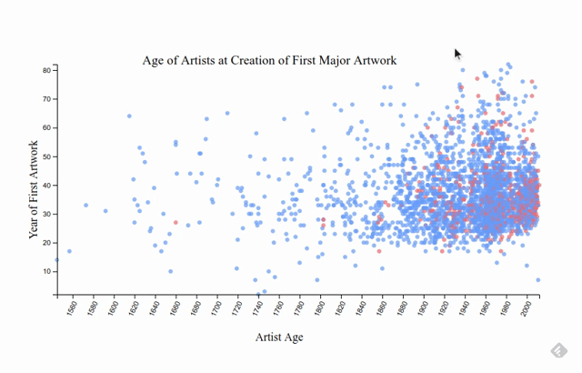

# TidyTuesday

Join the R4DS Online Learning Community in the weekly #TidyTuesday event!
Every week we post a raw dataset, a chart or article related to that dataset, and ask you to explore the data.
While the dataset will be “tamed”, it will not always be tidy! As such you might need to apply various R for Data Science techniques to wrangle the data into a true tidy format.
The goal of TidyTuesday is to apply your R skills, get feedback, explore other’s work, and connect with the greater #RStats community!
As such we encourage everyone of all skills to participate!

```{r setup, results='hide', message=FALSE}
knitr::opts_chunk$set(echo = TRUE, message=F)
sapply(c('tidyverse','tidytuesdayR','r2d3','here','ggplot2','ggthemes'), require, character.only=T)
# knitr::opts_knit$set(root.dir = here())
```

# Load the weekly Data

Dowload the weekly data and make available in the `tt` object.

```{r Load}

tt <- tt_load("2021-01-12")

```


# Readme

Take a look at the readme for the weekly data to get insight on the dataset.
This includes a data dictionary, source, and a link to an article on the data.

```{r Readme, eval = interactive(), include=FALSE}

tt

```


# Glimpse Data

Take an initial look at the format of the data available.

```{r Glimpse}
artists <- tt[[1]]
artwork <- tt[[2]]

tt %>% 
  map(glimpse)

```

# Wrangle

There are `r round(length(artwork)/length(artists),1)` artworks per artist in the dataset. Showing the distribution:

```{r Wrangle}
artworkper <- artwork %>% 
  count(artist) %>% arrange(desc(n))

ggplot(artworkper, aes(x=n)) +
  geom_density(fill="#69b3a2", color="#e9ecef", alpha=0.8, stat='count') +
  scale_x_continuous(trans='log', breaks=scales::log_breaks())+
    labs(title="Distribution of number of artworks per artist", x='Number of Artworks',
      y='Number of Artists') +
    theme_gdocs()

head(artworkper)
```

A few artists are responsible for a disproportionate share of works

# Question

At what age did artists usually produce their first major work for Tate, by year and gender?

```{r narrow_data}

first_year <- artwork %>% 
  group_by(artistId) %>% 
  filter(!is.na(year), year == min(year), artistRole %in% c('artist')) %>% 
  ungroup() %>% 
  select(year_create = year, artistId)

firsts <- left_join(first_year, artists, by = c('artistId'='id')) %>% 
  arrange(year_create) %>% 
  filter(!is.na(yearOfBirth), yearOfBirth != year_create, !duplicated(artistId), !is.na(gender)) %>% 
  transmute(gender, age=year_create-yearOfBirth, year_create, artistId)
  
```

Generate the graph
```{r d3, eval=FALSE}
r2d3(data=firsts, script = "2021_01_12_tidy_tuesday.js", viewer='internal')
```


# Interactivity

A recording of the interaction for display purposes:


