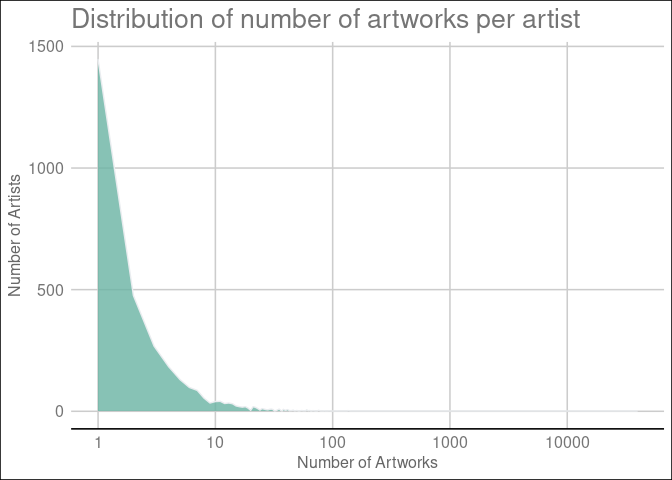
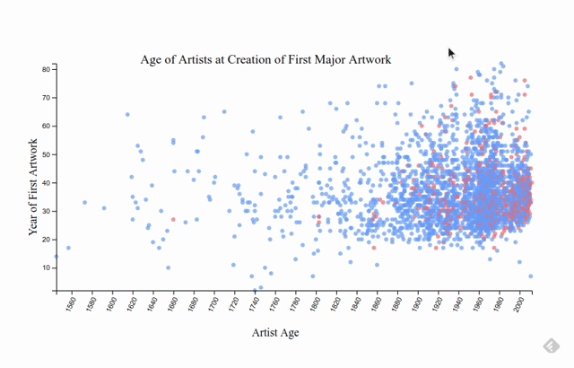

TidyTemplate
================
2021-01-13

# TidyTuesday

Join the R4DS Online Learning Community in the weekly \#TidyTuesday
event\! Every week we post a raw dataset, a chart or article related to
that dataset, and ask you to explore the data. While the dataset will be
“tamed”, it will not always be tidy\! As such you might need to apply
various R for Data Science techniques to wrangle the data into a true
tidy format. The goal of TidyTuesday is to apply your R skills, get
feedback, explore other’s work, and connect with the greater \#RStats
community\! As such we encourage everyone of all skills to participate\!

``` r
knitr::opts_chunk$set(echo = TRUE, message=F)
sapply(c('tidyverse','tidytuesdayR','r2d3','here','ggplot2','ggthemes'), require, character.only=T)
# knitr::opts_knit$set(root.dir = here())
```

# Load the weekly Data

Dowload the weekly data and make available in the `tt` object.

``` r
tt <- tt_load("2021-01-12")
```

    ## 
    ##  Downloading file 1 of 2: `artists.csv`
    ##  Downloading file 2 of 2: `artwork.csv`

# Readme

Take a look at the readme for the weekly data to get insight on the
dataset. This includes a data dictionary, source, and a link to an
article on the data.

# Glimpse Data

Take an initial look at the format of the data available.

``` r
artists <- tt[[1]]
artwork <- tt[[2]]

tt %>% 
  map(glimpse)
```

    ## Rows: 3,532
    ## Columns: 9
    ## $ id           <dbl> 10093, 0, 2756, 1, 622, 2606, 9550, 623, 624, 625, 2411,…
    ## $ name         <chr> "Abakanowicz, Magdalena", "Abbey, Edwin Austin", "Abbott…
    ## $ gender       <chr> "Female", "Male", "Female", "Male", "Male", "Male", "Fem…
    ## $ dates        <chr> "born 1930", "1852–1911", "1898–1991", "1760–1803", "bor…
    ## $ yearOfBirth  <dbl> 1930, 1852, 1898, 1760, 1935, 1964, 1967, 1940, 1947, 19…
    ## $ yearOfDeath  <dbl> NA, 1911, 1991, 1803, NA, 1993, NA, NA, 2014, NA, 1792, …
    ## $ placeOfBirth <chr> "Polska", "Philadelphia, United States", "Springfield, U…
    ## $ placeOfDeath <chr> NA, "London, United Kingdom", "Monson, United States", "…
    ## $ url          <chr> "http://www.tate.org.uk/art/artists/magdalena-abakanowic…
    ## Rows: 69,201
    ## Columns: 20
    ## $ id                 <dbl> 1035, 1036, 1037, 1038, 1039, 1040, 1041, 1042, 10…
    ## $ accession_number   <chr> "A00001", "A00002", "A00003", "A00004", "A00005", …
    ## $ artist             <chr> "Blake, Robert", "Blake, Robert", "Blake, Robert",…
    ## $ artistRole         <chr> "artist", "artist", "artist", "artist", "artist", …
    ## $ artistId           <dbl> 38, 38, 38, 38, 39, 39, 39, 39, 39, 39, 39, 39, 39…
    ## $ title              <chr> "A Figure Bowing before a Seated Old Man with his …
    ## $ dateText           <chr> "date not known", "date not known", "?c.1785", "da…
    ## $ medium             <chr> "Watercolour, ink, chalk and graphite on paper. Ve…
    ## $ creditLine         <chr> "Presented by Mrs John Richmond 1922", "Presented …
    ## $ year               <dbl> NA, NA, 1785, NA, 1826, 1826, 1826, 1826, 1826, 18…
    ## $ acquisitionYear    <dbl> 1922, 1922, 1922, 1922, 1919, 1919, 1919, 1919, 19…
    ## $ dimensions         <chr> "support: 394 x 419 mm", "support: 311 x 213 mm", …
    ## $ width              <dbl> 394, 311, 343, 318, 243, 240, 242, 246, 241, 243, …
    ## $ height             <dbl> 419, 213, 467, 394, 335, 338, 334, 340, 335, 340, …
    ## $ depth              <dbl> NA, NA, NA, NA, NA, NA, NA, NA, NA, NA, NA, NA, NA…
    ## $ units              <chr> "mm", "mm", "mm", "mm", "mm", "mm", "mm", "mm", "m…
    ## $ inscription        <chr> NA, NA, NA, NA, NA, NA, NA, NA, NA, NA, NA, NA, NA…
    ## $ thumbnailCopyright <lgl> NA, NA, NA, NA, NA, NA, NA, NA, NA, NA, NA, NA, NA…
    ## $ thumbnailUrl       <chr> "http://www.tate.org.uk/art/images/work/A/A00/A000…
    ## $ url                <chr> "http://www.tate.org.uk/art/artworks/blake-a-figur…

    ## $artists
    ## # A tibble: 3,532 x 9
    ##       id name  gender dates yearOfBirth yearOfDeath placeOfBirth placeOfDeath
    ##    <dbl> <chr> <chr>  <chr>       <dbl>       <dbl> <chr>        <chr>       
    ##  1 10093 Abak… Female born…        1930          NA Polska       <NA>        
    ##  2     0 Abbe… Male   1852…        1852        1911 Philadelphi… London, Uni…
    ##  3  2756 Abbo… Female 1898…        1898        1991 Springfield… Monson, Uni…
    ##  4     1 Abbo… Male   1760…        1760        1803 Leicestersh… London, Uni…
    ##  5   622 Abra… Male   born…        1935          NA Wigan, Unit… <NA>        
    ##  6  2606 Absa… Male   1964…        1964        1993 Tel Aviv-Ya… Paris, Fran…
    ##  7  9550 Abts… Female born…        1967          NA Kiel, Deuts… <NA>        
    ##  8   623 Acco… Male   born…        1940          NA New York, U… <NA>        
    ##  9   624 Ackl… Male   1947…        1947        2014 Isleworth, … <NA>        
    ## 10   625 Ackr… Male   born…        1938          NA Leeds, Unit… <NA>        
    ## # … with 3,522 more rows, and 1 more variable: url <chr>
    ## 
    ## $artwork
    ## # A tibble: 69,201 x 20
    ##       id accession_number artist artistRole artistId title dateText medium
    ##    <dbl> <chr>            <chr>  <chr>         <dbl> <chr> <chr>    <chr> 
    ##  1  1035 A00001           Blake… artist           38 A Fi… date no… Water…
    ##  2  1036 A00002           Blake… artist           38 Two … date no… Graph…
    ##  3  1037 A00003           Blake… artist           38 The … ?c.1785  Graph…
    ##  4  1038 A00004           Blake… artist           38 Six … date no… Graph…
    ##  5  1039 A00005           Blake… artist           39 The … 1826–7,… Line …
    ##  6  1040 A00006           Blake… artist           39 Ciam… 1826–7,… Line …
    ##  7  1041 A00007           Blake… artist           39 The … 1826–7,… Line …
    ##  8  1042 A00008           Blake… artist           39 The … 1826–7,… Line …
    ##  9  1043 A00009           Blake… artist           39 The … 1826–7,… Line …
    ## 10  1044 A00010           Blake… artist           39 The … 1826–7,… Line …
    ## # … with 69,191 more rows, and 12 more variables: creditLine <chr>, year <dbl>,
    ## #   acquisitionYear <dbl>, dimensions <chr>, width <dbl>, height <dbl>,
    ## #   depth <dbl>, units <chr>, inscription <chr>, thumbnailCopyright <lgl>,
    ## #   thumbnailUrl <chr>, url <chr>

# Wrangle

There are 2.2 artworks per artist in the dataset. Showing the
distribution:

``` r
artworkper <- artwork %>% 
  count(artist) %>% arrange(desc(n))

ggplot(artworkper, aes(x=n)) +
  geom_density(fill="#69b3a2", color="#e9ecef", alpha=0.8, stat='count') +
  scale_x_continuous(trans='log', breaks=scales::log_breaks())+
    labs(title="Distribution of number of artworks per artist", x='Number of Artworks',
      y='Number of Artists') +
    theme_gdocs()
```

<!-- -->

``` r
head(artworkper)
```

    ## # A tibble: 6 x 2
    ##   artist                             n
    ##   <chr>                          <int>
    ## 1 Turner, Joseph Mallord William 39389
    ## 2 Jones, George                   1046
    ## 3 Moore, Henry, OM, CH             623
    ## 4 Daniell, William                 612
    ## 5 Beuys, Joseph                    578
    ## 6 British (?) School               388

A few artists are responsible for a disproportionate share of works

# Question

At what age did artists usually produce their first major work for Tate,
by year and gender?

``` r
first_year <- artwork %>% 
  group_by(artistId) %>% 
  filter(!is.na(year), year == min(year), artistRole %in% c('artist')) %>% 
  ungroup() %>% 
  select(year_create = year, artistId)

firsts <- left_join(first_year, artists, by = c('artistId'='id')) %>% 
  arrange(year_create) %>% 
  filter(!is.na(yearOfBirth), yearOfBirth != year_create, !duplicated(artistId), !is.na(gender)) %>% 
  transmute(gender, age=year_create-yearOfBirth, year_create, artistId)
```

Generate the
graph

``` r
r2d3(data=firsts, script = "2021_01_12_tidy_tuesday.js", viewer='internal')
```

# Interactivity

A recording of the interaction for display purposes: 
